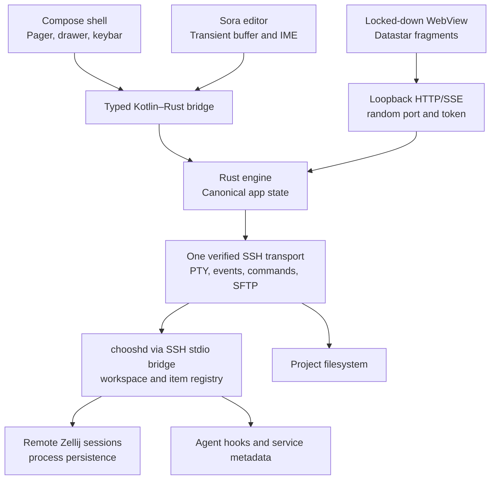

# Choosh: System Design and Delivery Plan

Status: proposed baseline, 14 July 2026

## 1. Product definition

Choosh is an Android-only, agent-neutral remote development cockpit. A **workspace** is one named project root plus one Zellij session with exactly the same name. It connects to a trusted macOS/arm64 or Linux/x86_64 host over SSH and presents:

- persistent interactive agent and service terminals backed by the workspace's Zellij session;
- interactive Codex, OpenCode or Claude Code sessions;
- a remote project browser;
- Markdown preview and annotation pages;
- source editing through an embedded Sora editor;
- client-side Git status and textual diff review;
- Android notifications when the active agent requires user input;
- no bundled agent, local compiler, Node runtime, public server, or desktop/iOS client.

The initial application ID is `ai.choosh`. The recommended repository and display name are `choosh` and **Choosh**. Apache-2.0 is the proposed project licence; Sora remains an LGPL-2.1+ dependency and needs a distribution-compliance review before release.

## 2. Design principles

1. **One network boundary:** remote traffic travels through a host-key-verified SSH connection.
2. **Rust owns durable state:** the Android engine owns client state; the host daemon owns the authoritative workspace/process registry; document revisions and saves remain client-controlled over SFTP.
3. **Views are projections:** Compose, Sora and the WebView may hold transient UI state, but cannot independently mutate durable state.
4. **Vertical slices before breadth:** prove one terminal, one Markdown document and one editable source file before adding IDE features.
5. **Agent neutrality:** Choosh controls the terminal and files, not a particular agent protocol.

## 3. Architecture



### Android shell

Jetpack Compose owns navigation, connection setup, the explorer, gestures and the page ribbon. The logical page sequence for a workspace is:

`Explorer → PinnedItem*`

The explorer is permanently the left-most page. Its sections are active agents, registered development services, changed files and the searchable project tree. Tapping any row toggles that item in the ordered pinned set. Interacting inside a pinned page never unpins it.

Pinned item types are:

- `AgentTerminal`: the complete interactive TUI from its Zellij tab;
- `MarkdownPreview`: rendered and annotatable in the locked-down WebView;
- `SourceEditor`: edited through Sora;
- `GitDiff`: a native unified diff for a changed file and comparison mode;
- `WebService`: a WebView connected through an SSH tunnel to its registered port.

Only one terminal renderer, one document WebView, one service WebView and one Sora `CodeEditor` need remain mounted. Swiping changes their bound model rather than creating a heavyweight view per page. Compose embeds Sora through `AndroidView`.

Horizontal paging activates only after a deliberate edge or threshold gesture. Sora selection, WebView scrolling and terminal mouse input win ordinary gestures. Hardware and soft-key actions use the same command dispatcher.

### Rust engine

The engine is a Tokio actor system behind a narrow command/event API. Suggested crates/modules:

- `connection`: host profiles, host-key verification, reconnect/backoff;
- `ssh`: multiplexed PTY, exec and SFTP channels;
- `host`: versioned RPC, workspace/item snapshots and event subscription;
- `zellij`: interactive PTY attachment and serialized actions delegated through the host;
- `documents`: revisioned buffers, remote-change detection and atomic saves;
- `git`: remote Git metadata/blob RPC and client-side diff models;
- `project`: root-confined directory traversal, search and metadata;
- `annotations`: local database and optional project export;
- `web`: loopback Axum server, Maud fragments and Datastar SSE;
- `android`: generated or hand-written JNI boundary.

Use a single state actor as the mutation authority. Slow I/O runs in child tasks that return typed results to the actor. Kotlin receives immutable snapshots/events and sends commands containing stable IDs and expected revisions.

### Sora document protocol

Opening a file returns `{document_id, revision, content, encoding, line_ending, read_only}`. Sora emits incremental `ContentChangeEvent`s, translated to UTF-8 range edits with `base_revision`. Rust validates and applies each edit, then returns the new revision. A stale edit produces a resync/conflict event rather than silent overwrite.

Saving is debounced but explicit state is visible: `clean`, `dirty`, `saving`, `conflicted`, `offline`. Remote writes use a sibling temporary file plus rename where the server supports it. Before save, compare the remote identity captured at open (mtime, size and, when needed, hash). Preserve encoding and line endings. V1 should reject binary files and open oversized text read-only.

Sora should initially provide text editing, undo/redo, search and basic TextMate highlighting. LSP, completion and tree-sitter are later features—not prerequisites for the remote-control product.

### Git status and client-side diff

The repository stays on the host; Android does not maintain a second checkout. `chooshd` exposes constrained Git RPC operations that return:

- repository identity, branch/HEAD and worktree state;
- changed paths with added, modified, deleted, renamed, conflicted and untracked status;
- staged versus unstaged state;
- bounded content streams for the relevant `HEAD`, index and worktree versions.

The Android Rust engine computes line diffs locally, initially using a bounded histogram/Myers implementation such as `imara-diff`. This keeps display policy, hunk formation and interaction client-side without transferring `.git` object storage or embedding JGit/libgit2 on Android.

The changed-files explorer section groups files by state and offers `Working tree`, `Staged` and `Combined` comparisons. Selecting a row pins `GitDiff(path, comparison)`. The Compose diff page uses a mobile-first unified layout with file header, hunk navigation, line numbers, addition/deletion styling and search. Selecting a changed line pins or focuses the corresponding Sora editor at the new-file line; deleted-only lines open the nearest surviving location.

V1 diffs are review-only. Staging, unstaging, discard, commit, branch and push are deliberately excluded. Renames retain old/new paths; untracked files diff against empty content; deleted files diff to empty content. Binary, submodule and oversized files show status and metadata rather than attempting a textual diff. Inputs and generated hunks have explicit byte, line and execution-time limits.

Git output is never parsed from human-formatted terminal text. The host invokes Git with fixed arguments, disabled external diff/text-conversion helpers and machine-readable formats. Returned paths are canonicalized beneath the registered workspace root before Android can request content or open Sora.

### Markdown and large files

The Rust loopback server renders Markdown with Maud and streams Datastar fragment updates. Remote images and large assets are exposed as root-confined loopback URLs supporting HTTP ranges; the handler reads ranges over SFTP and never exposes SSH credentials or remote paths directly.

Annotations are Rust-owned records anchored by document revision plus surrounding-text fingerprints. Store them locally first; provide explicit export to `.choosh/annotations.json` or Markdown so a remote agent can consume them without coupling Choosh to that agent.

### Host daemon, workspace and Zellij lifecycle

`chooshd` is a small per-user daemon for macOS/arm64 and Linux/x86_64. It listens only on a user-owned Unix socket with mode `0600`. Android reaches it through `choosh-host rpc`, an SSH exec process that proxies framed RPC over stdio; the daemon never opens a network port. The host installer configures a user-level LaunchAgent or systemd service, requiring no root privileges.

The daemon owns an explicit workspace registry. A workspace record contains `{id, name, canonical_project_root}` and derives `zellij_session = name`. Names must satisfy Zellij's session-name rules and be unique per host. Choosh never discovers workspaces by scanning the filesystem. Registration validates the root and either creates the same-named Zellij session or adopts it after explicit confirmation.

Each managed Zellij tab has a typed item record: agent, development service or ordinary terminal. Agent items identify the adapter and tab/pane target. Service items additionally record their declared port and protocol. Zellij owns PTYs and process continuity; `chooshd` owns names, types, lifecycle and discoverability.

Opening an agent page attaches the client terminal to that agent's Zellij target. Swiping to another agent rebinds the single renderer while both remote TUIs continue running. Disconnecting Choosh detaches the client but leaves the daemon, Zellij, agents, services and scrollback running.

The daemon performs Zellij lookup/create/control directly; no WASM plugin is required. Its internal session interface remains abstract enough to add tmux later without changing the client protocol.

### Agent interoperability and notifications

Codex, OpenCode and Claude Code continue to run as their normal interactive TUIs, each in a managed Zellij tab. Choosh does not parse or reimplement their chat protocols. `chooshd` provides the common, versioned event bridge:

- agent hooks invoke `choosh-host emit`, which forwards to the Unix socket and exits;
- the Android RPC connection subscribes to sequenced events;
- events remain in a bounded per-workspace spool so reconnect can resume after the last acknowledged sequence.

The initial normalized events are:

- `input_required`: approval, permission, elicitation or agent waiting for the next prompt;
- `turn_completed`: terminal turn finished;
- `files_changed`: root-relative candidate paths;
- `agent_status`: started, busy, idle, failed or stopped.

Adapters use official extension points:

- **Codex:** `PermissionRequest`, `PostToolUse`, `Stop` and `UserPromptSubmit` hooks. Its built-in `approval-requested`/turn terminal notifications are a fallback.
- **Claude Code:** `PermissionRequest`, `Notification`, `FileChanged`, `PostToolUse`, `Stop` and `UserPromptSubmit` hooks.
- **OpenCode:** a small global plugin observes `permission.asked`, `file.edited`, `session.diff`, `session.idle`, `session.error` and prompt/tool events.

Hooks are observational: they must not approve, deny, rewrite or block agent operations. Installation is an explicit per-host onboarding action that preserves existing user configuration. Launchers set `CHOOSH_WORKSPACE`, `CHOOSH_ROOT` and `CHOOSH_AGENT`; hooks ignore sessions without these variables.

The daemon validates and sequences events; Android deduplicates and rate-limits notifications. `input_required` creates one Android notification per agent, updated rather than multiplied. Tapping it connects to the host, ensures that agent is pinned, focuses its interactive terminal page and clears the notification. Notification text contains only workspace, agent and a coarse reason—never commands, prompts, file contents or credentials.

Agent-reported paths are hints, not authority. At prompt start and turn end, Choosh also compares Git status/diff metadata when available. Every candidate path is canonicalized under the workspace root before display. The changed-files tray shows status and path; selecting a text file opens the canonical remote revision in Sora, while unsupported/binary files open read-only or are rejected.

### Registered development services

Development servers must be launched explicitly through the host CLI, for example:

```sh
choosh service run --workspace app --name web --port 3000 -- npm run dev
```

The CLI asks `chooshd` to create a dedicated Zellij tab, starts the command there and records `{item_id, name, tab_target, port, protocol, status}`. This avoids unreliable process and port inference. Agent instructions may direct agents to use the same launcher.

Pinning a service requests an SSH `direct-tcpip` tunnel from an ephemeral Android loopback port to the declared host loopback port, then opens that origin in the service WebView. Raw TCP forwarding preserves HTTP, WebSockets and SSE. Unpinning closes the WebView and tunnel but not the remote service. Stopping the service is a separate explicit action.

### Security boundary

- Require known-host verification; show SHA-256 fingerprints on first trust and loud mismatch failures.
- Restrict the daemon to a `0600` Unix socket and authenticate RPC with the local user identity plus protocol handshake.
- Store private keys/passphrases through Android Keystore-backed encryption; never expose them to WebView or logs.
- Bind HTTP only to `127.0.0.1` on an ephemeral port and require an unguessable per-process token.
- Disable WebView file/content access, arbitrary navigation, mixed content and JavaScript bridges. Bundle Datastar locally and enforce a restrictive CSP.
- Sanitize Markdown HTML by default. Resolve and canonicalize every project path before SFTP access.
- Build remote commands from fixed executables and separately encoded arguments—never interpolate user text into a shell command.
- Disable Git external diff/text-conversion execution and bound every blob/diff request before allocation.
- Permit tunnels only to ports declared by registered services; bind their Android endpoints to loopback and close them on disconnect/unpin.
- Redact terminal/document content from telemetry. V1 should have no remote analytics.

## 4. Repository layout

```text
choosh/
  android/app/                 Android entry point and packaging
  android/ui/                  Compose shell and platform adapters
  rust/choosh-core/            State engine and domain model
  rust/choosh-android/         JNI/UniFFI-facing boundary
  rust/choosh-web/             Axum, Maud and Datastar rendering
  rust/chooshd/                Host workspace/item daemon
  rust/choosh-host/            RPC, hook and service CLI
  protocol/                    Versioned schemas and fixtures
  docs/adr/                    Architecture decisions
  docs/threat-model.md
```

CI builds Android arm64-v8a first, with x86_64 for emulators. GitHub Releases publish a monotonically versioned, signed APK with stable filenames, checksums and release notes so Obtainium can track it.

## 5. Delivery plan

### Milestone 0 — risk spikes and skeleton

- Create the repository, Gradle/Cargo workspace, package `ai.choosh`, CI and dependency/licence inventory.
- Embed Sora in Compose and prove incremental edit events without feedback loops.
- Choose and prove the Kotlin–Rust binding and Android cross-compilation route.
- Prove host-key-verified SSH with PTY, exec and SFTP channels over one connection.
- Prove daemon RPC over SSH stdio, explicit workspace registration and one typed Zellij item.
- Prove one normalized permission, idle and changed-file event from each supported agent.
- Prove remote HEAD/index/worktree blob retrieval and a bounded client-side diff.
- Prove a declared HTTP service through SSH `direct-tcpip`, including WebSockets.
- Time-box terminal rendering: compare an embeddable Rust renderer with a proven Android terminal view behind a common interface.
- Publish an unsigned/internal APK through GitHub Releases and confirm Obtainium detection.

**Exit:** a reproducible app opens a local Sora document, calls Rust, and installs from a release URL.

### Milestone 1 — first remote vertical slice

- Host profile and fingerprint-confirmation UI.
- Connect, list explicitly registered workspaces and register/select one workspace.
- Launch and pin one interactive agent terminal in its managed Zellij tab.
- Browse a root-confined remote directory over SFTP.
- Display a machine-readable changed-files list for a Git workspace.
- Open and render one Markdown file through the loopback WebView.

**Exit:** from a clean install, a user reaches a remote project, controls an agent in Zellij and reads its README without exposing another port.

### Milestone 2 — daemon registry and agent notifications

- Cross-build and install `chooshd`/`choosh-host` for macOS/arm64 and Linux/x86_64.
- Implement explicit workspace registration and typed Zellij item lifecycle.
- Add opt-in, merge-safe adapters for Codex, Claude Code and OpenCode.
- Implement sequenced event following, reconnect replay, bounds and redaction.
- Generate deduplicated Android notifications only when user input is required.
- Build the changed-files tray with root-confined paths and Git reconciliation.

**Exit:** each supported agent can request input and trigger a deep-linked Android notification; its changed files appear without terminal-output parsing.

### Milestone 3 — explorer, pinning and service previews

- Build the fixed left-most explorer with active agents/services above searchable files.
- Add changed files between services and the project tree, grouped by staged/unstaged status.
- Implement ordered pin/unpin state and `Explorer → PinnedItem*` swiping.
- Pin a native unified `GitDiff` page computed by Android Rust.
- Rebind the interactive terminal renderer between pinned agent tabs.
- Implement explicit service launching and loopback SSH tunnels for HTTP, WebSockets and SSE.
- Preserve pin state across reconnect while making destructive stop/terminate actions separate.

**Exit:** reopening a workspace restores its explorer and pinned pages; agents remain interactive and a registered web service renders through SSH without a public port.

### Milestone 4 — safe source editing

- Revisioned Sora adapter, syntax selection and dirty/save/conflict UI.
- Atomic SFTP save, offline queue policy and remote-change detection.
- Search, undo/redo and large-file/read-only thresholds.
- Open changed-file events in Sora at the latest canonical remote revision.
- Open a selected diff line in Sora with correct old/new line mapping.

**Exit:** edits survive rotation/reconnect and cannot silently overwrite a concurrently changed remote file.

### Milestone 5 — Markdown annotations and asset streaming

- Selection/comment annotation UX with resilient anchors.
- Range-capable image/asset routes and cache bounds.
- Annotation export suitable for any terminal agent.

**Exit:** a user can review a project plan, attach comments, reconnect and export those comments in an agent-readable form.

### Milestone 6 — security and public release

- Threat-model review, command/path fuzzing, WebView tests, credential redaction and dependency scanning.
- Accessibility, keyboard, tablet and low-memory testing.
- Reproducible signed release, SBOM, checksums, upgrade test and Obtainium instructions.

**Exit:** no public listeners, no host-key bypass, no traversal outside the selected root, and a tested upgrade preserving profiles and annotations.

## 6. Explicit non-goals for V1

- Android/iOS/desktop parity;
- local shells, compilers or containers;
- automatic filesystem workspace discovery or arbitrary process/port inference;
- arbitrary WebView browsing;
- Git mutation UI (stage, discard, commit, branch, push), LSP or debugger integration;
- multi-user collaboration;
- native reimplementations of agent chat/session protocols.
- native parsed chat transcripts in place of the agents' interactive TUIs.

## 7. First decisions to record as ADRs

1. Rust as durable-state authority with revisioned UI projections.
2. SSH as the sole remote transport and loopback HTTP as an internal adapter only.
3. Compose shell plus embedded Sora and WebView.
4. Explicit host workspace registration; workspace name equals Zellij session name.
5. `chooshd` owns workspace and typed-item metadata; Zellij owns persistent PTYs and processes.
6. Interactive agent TUIs rather than native parsed chat transcripts.
7. Explicit development-service launch and declared ports rather than process inference.
8. Observational agent adapters with a shared event protocol.
9. Host-supplied Git metadata/blobs with bounded client-side textual diff computation.
10. Terminal renderer selected only after the Milestone 0 benchmark.

## Sources

- [Sora Editor repository and feature set](https://github.com/Rosemoe/sora-editor)
- [Sora `CodeEditor` implementation](https://github.com/Rosemoe/sora-editor/blob/main/editor/src/main/java/io/github/rosemoe/sora/widget/CodeEditor.java)
- [Codex lifecycle hooks](https://developers.openai.com/codex/hooks)
- [Codex terminal notifications](https://developers.openai.com/codex/config-advanced#notifications)
- [Claude Code hooks](https://code.claude.com/docs/en/hooks)
- [OpenCode plugin events](https://opencode.ai/docs/plugins/)
- [Squircle CE modular Git/SFTP/editor layout](https://github.com/massivemadness/Squircle-CE/blob/master/settings.gradle.kts)
- [Squircle CE local JGit implementation](https://github.com/massivemadness/Squircle-CE/blob/master/feature-git/impl/src/main/kotlin/com/blacksquircle/ui/feature/git/data/repository/GitRepositoryImpl.kt)
- [PuppyGit Compose diff screen](https://github.com/catpuppyapp/PuppyGit/blob/main/app/src/main/java/com/catpuppyapp/puppygit/screen/DiffScreen.kt)
- [imara-diff](https://github.com/pascalkuthe/imara-diff)
- [Zellij CLI actions](https://zellij.dev/documentation/cli-actions)
- [Zellij programmatic-control ordering](https://zellij.dev/documentation/programmatic-control.html)
