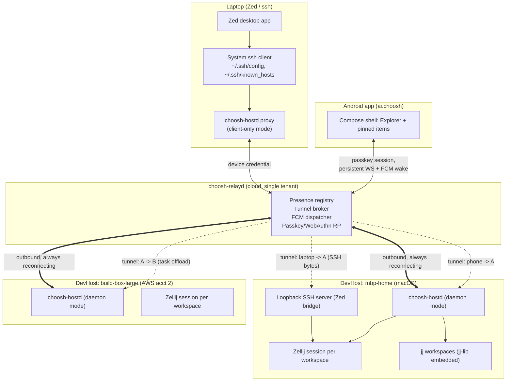

# Choosh: System Design

Status: target architecture, 14 August 2026. This supersedes every prior design
document in this repository. There is no shipped user base and no backwards
compatibility constraint — where this document conflicts with existing code,
the code is wrong.

## 1. What Choosh is

Choosh is a personal, always-on control plane for a fleet of development
hosts, driven primarily from an Android phone. You register development
machines ("devhosts") — cloud instances across any number of AWS/GCP/Azure
accounts, a Linux desktop, a Mac laptop — once each. After that, Choosh keeps
track of all of them, keeps their coding agents and dev services running in
Zellij, pushes a phone notification the moment an agent needs a decision, and
lets you act on it from wherever you are without SSH keys, fingerprints, or
passwords ever entering the picture again. When you sit down at a real
keyboard, the same fleet is reachable from Zed and a plain terminal with zero
extra setup.

Three things get built and released:

- **`choosh-relayd`** — a single small Rust binary you run once, in the
  cloud, as the fleet's rendezvous point.
- **`choosh-hostd`** — a single small Rust binary installed on every devhost
  (and, in a secondary mode, on every laptop that wants a Zed/SSH bridge into
  the fleet).
- **The Choosh Android app** (`ai.choosh`) — installable via Obtainium,
  the primary way you drive the fleet.

Everything else in this repository (the Zellij-derived native terminal, Sora
editor integration, Maud/Datastar Markdown rendering, the protocol crate) is
a supporting library consumed by one of those three.

## 2. Design principles

1. **Devhosts dial out; nothing dials in.** A devhost's network position
   (NAT, dynamic IP, different AWS account, laptop asleep half the day) is
   never Choosh's problem. `choosh-hostd` always initiates an outbound
   connection to `choosh-relayd` and reconnects with backoff. No devhost ever
   listens on a public port.
2. **The phone only ever talks to the relay.** The Android app never learns
   a devhost's address. Every byte — PTY output, RPC, a tunneled dev-server
   response, a Zed session — is a named stream brokered by `choosh-relayd`.
3. **The relay is a blind broker, not a protocol participant.** `relayd`
   authenticates identities (phone, laptop, devhost) and hands out tunnels
   between them. It never parses PTY bytes, SSH bytes, or HTTP bodies passing
   through a tunnel. This is what lets one relay carry terminals, RPC, web
   previews, and a real Zed/SSH session with no protocol-specific code in the
   relay.
4. **No passwords, ever.** Every human-facing surface (the Android app, any
   browser access to `relayd`) authenticates with a passkey. Every
   machine-facing surface (a devhost, a laptop proxy) authenticates with a
   device credential minted once from a passkey-authenticated session and
   stored in a platform keystore. Nobody types a password or manually
   confirms an SSH fingerprint after enrollment.
5. **jj owns concurrency.** Multiple agents editing the same repository is
   the normal case, not an edge case. Each agent gets its own `jj workspace`
   (an independent working copy sharing one repo store), and jj's
   working-copy-is-a-commit model means there is no staged/unstaged split,
   no index, and always-reversible history via the operation log.
6. **`choosh-hostd` owns durable host state; Zellij owns process survival.**
   Exactly as before: workspace/session registration is explicit, never
   filesystem discovery or process inference. This decision from the
   original design was correct and is unchanged.
7. **One daemon, few moving parts.** No Redis, no message queue, no
   Kubernetes. `relayd` and `hostd` are the only services that exist. `hostd`
   provisions everything else (Zellij, jj, mise-managed toolchains,
   zed-remote-server) rather than requiring them to be pre-installed.

## 3. System overview



## 4. Domain model

| Entity | Definition | Owned by |
| --- | --- | --- |
| **Repository** | A jj repo (optionally git-colocated for interop with GitHub/GitLab remotes). | The devhost filesystem. |
| **Project** | Metadata bound to a repository: default `mise.toml`, agent launch config, declared services, and a designated *primary Workspace* (explicit, defaults to the first Workspace registered for it, changeable later — tapping a Project in the Android fleet drawer opens this one directly). | `choosh-hostd` registry. |
| **DevHost** | A machine running `choosh-hostd` in daemon mode. Has an identity, a platform (`linux`, `macos`), and a cloud/account label used only for fleet display. | `choosh-relayd` (presence), `choosh-hostd` (local state). |
| **Workspace** | One named `jj workspace` (an independent working copy of a Project's repo) plus a Zellij session of the same name. This is the unit you register, open, and pin. | `choosh-hostd`. |
| **Item** | A typed thing living in a workspace's Zellij session: `AgentTerminal`, `Shell`, `WebService`, or an editor/session attachment. | `choosh-hostd`. |
| **Session** | An interactive attachment to an Item's PTY. Survives phone disconnects; multiple attach/detach cycles are normal. | Zellij, tracked by `choosh-hostd`. |
| **Identity** | A phone, a laptop-proxy instance, or a devhost, each with its own credential and capability scope. | `choosh-relayd`. |
| **Tunnel** | A named, brokered byte stream between two Identities, opened on demand and torn down on close. Carries PTYs, RPC, web-preview traffic, or raw SSH bytes indiscriminately. | `choosh-relayd`. |

A DevHost can host many Workspaces from many Projects. A Project can have
concurrent Workspaces on different DevHosts. This is unchanged from the
original entity model; only "Git worktree" became "jj workspace" and the
transport got a Relay layer in front of it.

## 5. `choosh-relayd`

Single Rust binary, deployed once (a small VM, Fly.io, or an ECS task — any
target that gives it a stable DNS name and lets it hold long-lived
connections). Single-tenant: it is your fleet's rendezvous point, not a
multi-user service.

### Responsibilities

- **Presence registry.** Tracks which DevHost identities currently hold an
  open outbound connection, their declared platform/account/label, and their
  last-seen timestamp. This is what powers the Android fleet view, including
  hosts in AWS accounts the phone has no credentials for — the phone only
  ever asks `relayd`, never AWS.
- **Tunnel broker.** On request from an authenticated Identity, opens a
  bidirectional byte stream to another Identity and hands both sides a
  tunnel handle. Never inspects payload bytes beyond the outer frame length.
- **FCM dispatcher.** Holds the phone's FCM registration token. When a
  devhost reports an event that needs the user's attention while the
  phone's persistent connection is closed, `relayd` sends a high-priority
  FCM data message that wakes the app and/or shows a notification.
- **WebAuthn relying party.** The only authentication surface a human ever
  touches. Issues short-lived, single-use enrollment tokens to
  already-authenticated sessions (phone or web), which is how a fresh
  devhost or laptop proves it's really you without a password.

### Deployment

`relayd` runs on a single EC2 instance you own. `just deploy <ec2-instance-name>`
builds the release binary and ships/restarts it on that instance — this is a
deliberate asymmetry with `hostd` (§6): `hostd` self-updates over the relay
because there can be many devhosts and the relay channel already exists to
reach them, but `relayd` *is* the relay, so having it push updates to itself
over its own tunnel is a needless chicken-and-egg risk. An explicit,
operator-triggered deploy from your own machine is simpler and safer for a
single always-on instance. `just deploy` is a thin wrapper: build →
`scp`/SSM-send the binary → restart the systemd unit → health-check the
socket, reusing the same EC2 Instance Connect / SSM path `njreid/devhost`'s
`ssm` tool already has for reaching an instance without an open port.

### WebAuthn implementation

**[`webauthn-rs`](https://github.com/kanidm/webauthn-rs)** is the
recommendation for the RP side. It's the most mature Rust WebAuthn/passkey
server library available: maintained by the Kanidm project, used in
production in Kanidm itself, tracks the WebAuthn Level 2/3 spec (resident
keys / discoverable credentials, attestation, `userVerification`), and ships
framework-agnostic (works fine behind `axum`, which fits `relayd`'s existing
loopback-HTTP heritage from `choosh-web`). It also has first-class support
for the "passkey" profile (no attestation ceremony friction, resident keys
required) rather than making you assemble that from lower-level FIDO2
primitives.

Android's Credential Manager API (`androidx.credentials`,
`CredentialManager.createCredential`/`getCredential` with a
`CreatePublicKeyCredentialRequest`/`GetPublicKeyCredentialOption`) speaks
standard W3C WebAuthn JSON under the hood via Google Play Services' FIDO2
implementation — it needs no Choosh-specific counterpart on the server, just
a normal WebAuthn RP. `webauthn-rs`'s `PublicKeyCredential`
request/response types round-trip that JSON directly, so there's no
translation layer to write; the Android app assembles the
`CreationOptions`/`RequestOptions` it gets from `relayd` into the
Credential Manager request objects and posts the result straight back.

Alternatives considered: `passkey-rs` (1Password) is aimed at *building an
authenticator*, not an RP server, so it's the wrong layer here — Android
itself is the authenticator. There's no other actively-maintained
Rust WebAuthn RP crate with comparable production usage as of this writing.

### Protocol shape

One persistent connection per Identity (WebSocket over TLS to start —
ubiquitous library support on Android, survives corporate proxies; QUIC is a
plausible later upgrade for connection migration on cellular handoff, not a
day-one requirement). Each connection multiplexes two kinds of frames, both
using the existing `choosh-protocol` envelope (4-byte length + payload):

- **Control frames** — typed JSON: enroll, list-devhosts, open-tunnel,
  agent-event, register-fcm-token, request-enrollment-token.
- **Tunnel frames** — an opaque payload tagged with a tunnel ID. `relayd`
  only ever routes these by ID; it does not decode them.

### Auth and enrollment

- **Phone / web (human):** Android Credential Manager (or a browser's
  platform authenticator) performs a WebAuthn ceremony against `relayd`'s RP
  ID. Success mints a long-lived device credential stored in Android
  Keystore (or a browser-bound credential for web access). Every later app
  open reuses that stored credential silently — the passkey ceremony only
  recurs for a brand-new device or an explicit revoke.
- **DevHost (machine):** never does WebAuthn — headless boxes can't reliably
  complete a browser ceremony. Instead, an already-authenticated phone or
  web session asks `relayd` for a single-use, short-lived enrollment token.
  That token goes into the install command:
  `curl -fsSL relay.example/install.sh | sudo sh -s -- --token=<token>`.
  `choosh-hostd` exchanges it once for a long-lived per-host credential
  (client certificate) used for every future outbound reconnect. `sudo` is
  accepted for this first install only (needed for `loginctl enable-linger`
  and the service-manager unit); nothing after that needs root.
- **Laptop proxy (machine):** identical enrollment-token flow, run once:
  `choosh-hostd proxy enroll --token=<token>`.

## 6. `choosh-hostd`

Single Rust binary, two modes.

### Daemon mode (`choosh-hostd serve`) — runs on every devhost

- **Workspace/item registry.** Same discipline as before: explicit
  registration, canonical roots, typed items, no filesystem discovery.
- **jj integration.** Links `jj-lib` directly (crates.io `jj-lib`, pinned to
  a specific release) rather than shelling out to the `jj` CLI — the same
  anti-string-parsing discipline the old design applied to `git`. See
  §8 for the file-browsing and diff API shape.
- **Zellij control.** Owns lookup/create/attach for the workspace's Zellij
  session via Zellij's IPC, exactly as before.
- **Agent event bridge.** Unchanged normalized event model
  (`input_required`, `turn_completed`, `files_changed`, `agent_status`) fed
  by observational hooks for Codex, Claude Code, and OpenCode. Hooks still
  cannot approve, deny, rewrite, or inject.
- **SSH server for the Zed/terminal bridge.** A loopback-bound SSH server
  (server-role reuse of the SSH crate that used to be the Android client's
  transport). Connections only ever arrive already-authenticated by
  `relayd`'s tunnel — `hostd` trusts the tunnel's identity claim and does not
  run its own SSH auth challenge. See §9.
- **Toolchain provisioning.** Reads each Project's `mise.toml` and runs
  `mise install` on workspace registration, so a Workspace is never missing
  the compiler/runtime versions it needs. `mise`, `zellij`, and `jj` are
  themselves bootstrapped by the platform install script (§10), not by
  `mise` recursively.
- **SSO/cloud-CLI auth bridge.** When an agent or the user runs `aws sso
  login` / `gcloud auth login` / `az login` / `gh auth login` on a headless
  devhost, `hostd` detects the device-code flow, emits an `auth_required`
  event over the same event bus as agent lifecycle events (relay-delivered,
  FCM-woken if the phone is backgrounded), and the phone opens the
  verification URL in a Custom Tab. On a devhost with its own display (a
  Mac at a desk), `hostd` just lets the local browser handle it — the relay
  round-trip only happens when there's no local browser to hand off to.
- **Self-update.** `relayd` can push an `UPDATE_BINARY` control frame
  (triggered from the Android app). `hostd` downloads the new binary
  alongside the running one, `chmod +x`, atomic `rename()`, then re-execs or
  asks the service manager to restart it.
- **Cross-host offload.** A `dev-exec --host=<id> <cmd>` entry point lets an
  agent on DevHost A ask `relayd` to broker a tunnel to DevHost B, run a
  command against a matching jj revision in an ephemeral workspace there,
  and stream results back — for heavyweight builds/tests that don't fit the
  box an agent happens to be running on.

### Proxy mode (`choosh-hostd proxy`) — runs on a laptop

- **`choosh-hostd proxy connect <host-id>`** is the literal `ProxyCommand`
  target: it authenticates to `relayd` with the laptop's stored device
  credential and pipes stdio to/from the tunnel `relayd` opens to that
  devhost's SSH server. This is what makes both `ssh <devhost>` and Zed's
  own SSH-based remote connection work unmodified — neither has to know
  Choosh exists.
- **`choosh-hostd proxy sync`** (run at enrollment and on a periodic
  timer/launch-agent) queries `relayd`'s current fleet list and each host's
  relay-attested SSH public key — captured once, at that host's enrollment,
  never learned through a manual fingerprint prompt — and writes/updates:
  - `~/.ssh/known_hosts`: one line per devhost, keyed by its stable alias.
  - `~/.ssh/config`: a `Host <alias>` block per devhost with
    `ProxyCommand choosh-hostd proxy connect %h`.

  The trust decision happens exactly once, cryptographically, at host
  enrollment (§5); after that, `ssh <devhost>` and Zed's remote-project
  picker just work, with no TOFU prompt and no typed password, and the
  fleet list staying current as hosts are added or retired.

### Platform lifecycle

- **Linux:** `systemd --user` unit, `loginctl enable-linger $USER` set
  during install (needs the one-time `sudo`) so the daemon survives the
  install SSH session closing.
- **macOS:** `launchd` LaunchAgent (`RunAtLoad`, `KeepAlive`). `hostd` claims
  an `IOPMAssertionCreateWithName` power assertion while any session, build,
  or agent task is active, releasing it when idle, so macOS sleep doesn't
  sever the relay connection mid-task.

## 7. Android app (`ai.choosh`)

- **Connects only to `choosh-relayd`.** Persistent WebSocket while the app
  process is alive; FCM high-priority data message wakes it (or raises a
  notification directly) when the OS has killed the process. This is a
  deliberate improvement over a foreground-service-holds-the-socket model:
  no permanent notification is required just to stay reachable, and
  background delivery no longer depends on surviving Doze/OEM process
  killing.
- **Auth is passkey-only**, via Android Credential Manager, as described in
  §5. No profile password, ever.
- **Fleet drawer above the per-workspace Explorer.** Before you're inside a
  Workspace, a left-drawer navigates the whole fleet with three
  switchable sort modes: `Project → DevHost → Workspace` (default),
  `DevHost → Workspace` scoped to Projects with current activity, and a
  flat list sorted by recency. Every mode flags any Workspace with an
  outstanding `input_required` the same way — attention state is a
  property of the row, not a separate mode — so switching sort order never
  hides something that needs you. Tapping a Project opens its designated
  primary Workspace directly rather than an intermediate list; tapping a
  DevHost or a Workspace row behaves as today's `Fleet → Workspace list →
  Workspace` flow (see [android-navigation.md](docs/specs/android-navigation.md)).
- **Fixed Explorer, swipeable pinned items** — unchanged UX shape from the
  original design: `Explorer → PinnedItem*`. Item types:
  - `AgentTerminal` — the agent's Zellij tab, full interactive TUI, native
    GPU-rendered terminal (Zelland-derived `wgpu`/`glyphon` +
    `libghostty-vt`, unchanged from before).
  - `JjChangeGraph` — an interactive rendering of the jj commit/operation
    graph for the workspace (§8), with tap-to-inspect and one-touch
    `jj undo` / `jj op restore`.
  - `JjDiff` — a native unified diff view. Hunks are computed by `hostd`
    via `jj-lib` and shipped as structured data; **the Android-side
    client-diff engine is cut entirely** — there's no longer a reason to
    reimplement Myers/histogram diffing on-device now that `hostd` has
    direct library access to jj's own diff.
  - `SourceEditor` — Sora, for editing when there's no desktop handy.
    Revisioned-edit protocol against `hostd`'s live working-copy file API
    (§8), unchanged in spirit from the old Sora document protocol.
  - `MarkdownPreview` — Maud/Datastar fragments in a locked-down WebView,
    unchanged.
  - `WebService` — a registered dev server, tunneled through `relayd`
    instead of an SSH `direct-tcpip` channel, otherwise unchanged UX.
  - `EditorPresence` — read-only: shows "editing in Zed on `mbp-home`" when
    a laptop has an attached Zed session against this workspace. The phone
    never drives Zed; it just shows that someone is.
- **Notifications** stay redacted (workspace/agent/coarse reason only, never
  file contents or command text), deduped per agent, and now arrive as
  actionable FCM notifications so `input_required` can be approved directly
  from the notification shade, not just by opening the app.

### Push setup

FCM needs a Firebase project and a registered Android app before any of
this works, but it's a one-time, fully scriptable step, not a manual
console click-through: the Firebase CLI (`firebase projects:addfirebase
<gcp-project-id>`, `firebase apps:create ANDROID --package-name ai.choosh`,
`firebase apps:sdkconfig ANDROID <app-id>`) creates the Firebase project on
top of a `gcloud projects create`-provisioned GCP project and produces the
`google-services.json` the APK build needs, non-interactively via
`firebase login:ci` or a service account. This belongs in the same
bootstrap tooling as everything else in this repo — a `just` recipe, not a
one-off manual step recorded in a doc that goes stale.

## 8. Deep dive: browsing a jj workspace from the phone

The old design read Git via host-supplied metadata/blobs and an on-device
Myers diff. jj changes both halves of that story for the better, because
`jj-lib` is a real embeddable library (not just a CLI) and because jj's
working copy has no index:

- **No staged/unstaged split.** The working copy *is* a commit (`@`). A save
  from Sora, or a file write from an agent or from Zed, just changes what
  `@` contains — jj snapshots it automatically. There is exactly one "current
  state" to show, diffed against its parent `@-`.
- **File tree + content.** For any revision (including historical ones),
  `hostd` reads file content straight out of jj's content-addressed store
  via `jj-lib`'s tree/store APIs — no filesystem access needed for anything
  but `@` itself. For `@`, `hostd` reads the real files on disk, exactly
  like the old SFTP path did, with the same root-confinement and
  range/bound discipline.
- **Diff.** `hostd` calls `jj-lib`'s own diff between two revisions
  (defaulting to `@- ` → `@`) and ships structured hunks (old/new line
  numbers, added/removed/context, rename pairing where jj already resolved
  it) — Android renders, it doesn't compute.
- **Conflicts are structural**, not text markers to parse: `jj-lib` exposes
  whether a tree entry is conflicted directly. The changed-files view flags
  conflicted paths distinctly; a resolution UI is a later milestone, same
  staged-rollout posture the old design took toward Git mutation.
- **Change graph.** `hostd` walks the commit graph and the operation log via
  `jj-lib` and returns typed nodes/edges (change id, commit id, description,
  author, workspace-head markers) for the native `JjChangeGraph` view. The
  operation log's built-in reversibility is what makes a one-tap `undo`
  safe to expose in V1 where Git mutation deliberately wasn't.
- **One workspace per agent.** `jj workspace add ../agent-b` gives a second
  agent an independent working copy of the same repo/store — this is the
  concrete mechanism behind "map distinct agent tasks to distinct
  workspaces" from earlier brainstorming, and it's exactly Choosh's existing
  Workspace = Zellij-session unit, just backed by jj instead of a plain
  directory.

Illustrative RPC shape (not a final schema — that's protocol/ work):

```text
workspace.tree.list  { workspace_id, path_prefix, revision? }
workspace.file.read  { workspace_id, path, revision?, range? }
workspace.diff        { workspace_id, from = "@-", to = "@" }
workspace.log          { workspace_id, revset?, limit }
workspace.op.log       { workspace_id, limit }
workspace.op.undo      { workspace_id, op_id }
workspace.status        { workspace_id }  -> changed paths + conflict flags
```

`jj-lib` does not carry the same API-stability guarantees as, say, `git2` —
it moves with jj itself. Pin to a specific release tag and expect to bump
deliberately; do not track a moving branch. Resolved, formerly an open
question — see §14.

## 9. Deep dive: tunneling a Zed remote session through relayd

Zed's remote development feature always works the same way, with no
alternative transport: the local Zed app opens a real SSH connection (via
the system `ssh` and your `~/.ssh/config`, including `ProxyCommand`) to the
target host, uploads or execs a matching-version `zed-remote-server` binary
over that channel, then speaks Zed's own RPC protocol over the same stdio
stream. `hostd` doesn't need to know anything about that RPC protocol — it
only needs to be a legitimate SSH endpoint that Zed can reach.

End-to-end:

1. **Devhost side.** `choosh-hostd serve` runs a loopback-bound SSH server.
   It does not do its own key-based client authentication — a connection
   only ever arrives via a `relayd`-brokered tunnel, and `relayd` has
   already authenticated the caller's identity before opening that tunnel.
   `hostd` trusts the tunnel's identity claim the same way it already
   trusts `relayd`'s outbound-connection identity for RPC. Zed's exec
   request carries the version it expects `zed-remote-server` to be; `hostd`
   checks that against its `mise`-managed cache and installs/updates it on
   the spot if it doesn't match (§10) before exec'ing — no separately
   maintained version-pinning story.
2. **Relay.** `relayd` treats this exactly like any other tunnel — raw bytes
   between two authenticated identities, tagged with a tunnel ID. It has no
   SSH-specific code at all; this is what "the relay is a blind broker"
   (§2.3) buys you.
3. **Laptop side.** `choosh-hostd proxy connect <host-id>` is the
   `ProxyCommand`. `~/.ssh/config` and `~/.ssh/known_hosts` are kept current
   by `choosh-hostd proxy sync` (§6), so `ssh mbp-home` and Zed's "Open
   Remote" picker both resolve without any manual step.
4. **Handoff.** From the phone, an "open on desktop" affordance on a
   workspace is purely informational (it doesn't need to *do* anything —
   the laptop's SSH config already works generically) but can show the
   exact host alias/workspace path for convenience. Once Zed attaches,
   `hostd` emits a presence event (`editor_attached: zed`) that the phone
   renders as the read-only `EditorPresence` item (§7).
5. **Concurrency.** Zed writing files and an agent writing files in the same
   workspace at the same time is the normal case jj is designed for — every
   write becomes part of the next `@` snapshot; there's no lock to contend
   for and no separate "reload from disk" step to get wrong.

Because `hostd`'s SSH server isn't Zed-specific, it also replaces the
earlier "Zellij web-client break-glass" idea for anyone with a laptop and a
terminal: `ssh mbp-home` (or `ssh mbp-home -- zellij attach app`) works the
same way, with the same zero-setup trust story. The phone-only break-glass
path (no laptop at all) still uses Zellij's own web client, tunneled through
`relayd` to a loopback port the same way `WebService` items are (§7),
rendered in a WebView.

## 10. Toolchain provisioning

Two tiers, both `mise`-driven but with different currency policies:

- **Project-pinned toolchains.** Per-Project `mise.toml` pins language
  runtimes and CLIs (`node`, `go`, `rust`, cloud CLIs). `hostd` runs
  `mise install` on workspace registration and injects `mise env` into every
  spawned agent, service, and shell process — never polluting the global
  environment or colliding across concurrent workspaces on the same host.
  These versions never move on their own; a project that pins `node@20`
  keeps getting `node@20` until someone edits `mise.toml`.
- **Host-managed tools.** `jj`, `zellij`, and `zed-remote-server` aren't
  project state — they're what `hostd` itself depends on to do its job.
  `hostd` keeps its own global `mise` config for these and checks/updates
  them at the natural trigger for each: `zed-remote-server` on the incoming
  Zed connection (§9, matched against the version Zed's exec request
  declares it wants), `jj`/`zellij` on daemon start and periodically
  thereafter. `mise`'s generic [`ubi` backend](https://github.com/houseabsolute/ubi)
  (`mise use ubi:zed-industries/zed[exe=zed-remote-server]@<version>`) covers
  tools like `zed-remote-server` that ship GitHub release binaries without a
  dedicated mise plugin, so no bespoke fetch/unpack code is needed in
  `hostd` itself.
- `mise` and the OS-level bits it needs (a C toolchain, `curl`, `unzip`) are
  installed by the platform bootstrap script (`curl -fsSL
  relay.example/install.sh | sudo sh -s -- token=<token>`), not by `mise`
  recursively — that script is the only place that needs OS-package-manager
  awareness (`dnf`/`apt`/`brew`-equivalent). Everything downstream of that
  (`jj`, `zellij`, `zed-remote-server`, every project toolchain) is `mise`'s
  job.
- **Relationship to `njreid/devhost`'s `ssm` tool:** that tool stays the
  AWS-specific "day 0" provisioner — creating the EC2 instance, wiring up
  the EC2 Instance Connect Endpoint and security group, and (per its idle-
  stop timer) managing the instance's power lifecycle. Its current
  toolchain-install script is superseded: instead of hand-installing Go,
  Rust, Zed's remote server, etc. in bash, its last step becomes handing off
  to Choosh's own bootstrap/enrollment script, which is cloud-agnostic and
  is what actually gets a box from "a running Amazon Linux instance" to
  "an enrolled, `mise`-provisioned devhost." `ssm`'s AWS-only concerns (SSM
  tunneling, EIC, idle auto-stop) have no equivalent need inside Choosh and
  stay exactly where they are.

## 11. Security model

- **No password ever reaches a human.** Passkeys for people; device
  credentials (minted from a passkey-authenticated session) for machines.
  No SSH fingerprint is ever manually confirmed by a user — trust is
  established once, cryptographically, at enrollment, and propagated from
  there (§5, §6).
- **`relayd` is now a trust-bearing intermediary**, not a dumb pipe from a
  security-review perspective, even though it's protocol-blind about tunnel
  contents (§2.3). It authenticates every identity and decides who may open
  a tunnel to whom. Its own availability and integrity are now
  load-bearing for the whole fleet — this was a real posture change from
  the old "no server at all" boundary and got its own dedicated M8
  threat-model pass: `docs/security/relayd-threat-model.md`.
- **Devhost-side surfaces stay loopback-only.** `hostd`'s RPC socket and SSH
  server bind to loopback; the only way to reach them is a `relayd`-brokered
  tunnel terminating in a local process `hostd` itself spawns, never a
  public listener.
- **Paths stay root-confined**, agent hooks stay observational-only, and
  notification text stays redacted (workspace/agent/coarse reason, never
  file contents or command text) — all unchanged from the original design;
  none of that was specific to SSH.
- **Command construction stays fixed-argv.** No shell interpolation of
  user- or agent-supplied text, for `jj`, `mise`, service launches, or the
  SSH server's exec path.

## 12. Deliberate cuts from the previous design

- Git support, `imara-diff`, and the Android-side diff engine — replaced by
  jj-lib on the host side.
- The SSH-only system boundary and per-connection fingerprint confirmation —
  replaced by relay-brokered tunnels and enrollment-time trust.
- Persistent foreground service as the sole notification path — replaced by
  FCM, with a persistent connection only while the app is actually alive.
- The `choosh-host rpc --stdio` exec-over-SSH bridge and the two-binary
  `chooshd`/`choosh-host` split — merged into one `choosh-hostd` binary; the
  split only existed to make the old SSH-stdio transport work.
- Manual per-host `known_hosts` fingerprint verification from the phone.

## 13. Target repository layout

```text
choosh/
  android/app/                  APK packaging, Compose shell, composition roots
  rust/choosh-relayd/           Relay: presence, tunnel broker, FCM, WebAuthn RP
  rust/choosh-hostd/            Host daemon + laptop proxy mode (merges old chooshd/choosh-host)
  rust/choosh-android-bridge/   JNI boundary
  rust/choosh-android-transport/  Relay client transport (WebSocket, replaces the old SSH client)
  rust/choosh-terminal-engine/  Pure-Rust VT100/ANSI terminal engine (grid/cursor/mode, key/mouse encoding)
  rust/choosh-web/              Markdown rendering + Zellij web-client fallback proxy
  rust/choosh-protocol/         Shared envelope/RPC/event wire types
  protocol/                     Versioned JSON Schemas and fixtures
  docs/                         Whatever documentation earns its keep going forward
```

`rust/choosh-android-transport` is repurposed, not new: it moves from "SSH
client to one host" to "relay client," and the underlying Russh investment
carries over. `rust/choosh-ssh` did not get the same treatment as planned:
its client-side code (host-key pinning, public-key client auth) was built
for the opposite direction (Android dialing out over SSH) and proved
unreusable for `choosh-hostd`'s SSH *server* role, so the loopback SSH
server (`choosh-hostd/src/ssh_server.rs`) was built fresh inside
`choosh-hostd` instead, and `choosh-ssh` was removed as legacy code rather
than repurposed (see PLAN.md's "Legacy pre-reset crates" note). `choosh-core`
and `choosh-testkit` were never built either: Android-side state lives in
Kotlin ViewModels rather than a Rust actor-model engine, and test fakes/
fixtures live per-crate (`#[cfg(test)]`) rather than in a shared crate.

## 14. Open questions

**Resolved:** `jj-lib` pinning strategy. `choosh-hostd`'s `Cargo.toml`
pins an exact release (`jj-lib = "0.44.0"`), and
[jj-integration.md](docs/specs/jj-integration.md) now states the bump
policy explicitly: pin an exact release and bump it "as a deliberate,
reviewed increment — never track a moving branch or a loose semver
range." No longer open.

- **`ubi` asset matching for `zed-remote-server`.** Zed's release assets
  are named per-platform (e.g. `zed-remote-server-linux-x86_64.gz`) and
  gzip-wrapped; confirm `mise`'s `ubi` backend's matching/unpack handles
  that pattern as-is or needs an explicit `matching`/`exe` override (§10).
- **Firebase automation identity.** Decide whether the `just` recipe that
  provisions the Firebase project/app (§7) authenticates via a stored
  `firebase login:ci` token or a service-account key, and where that
  credential itself lives.
- **LAN fast path.** Everything currently routes through `relayd` even when
  phone and devhost share a LAN. Worth a later optimization (local
  discovery, direct connection with `relayd` only for signaling) but
  explicitly not a day-one requirement — keeping one code path is more
  valuable early on than shaving latency for one deployment topology.
