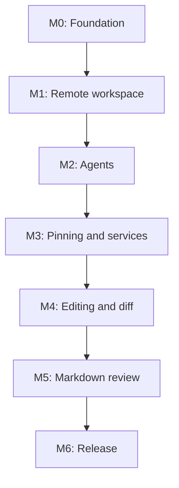

# Delivery milestones

Milestones are vertical, testable increments. A milestone is complete only when every mandatory requirement and exit scenario passes on macOS/arm64, Linux/x86_64, and the stated Android matrix.

| Milestone | Outcome | Channel |
|---|---|---|
| [M0](M0-foundation.md) | High-risk boundaries proven | Internal |
| [M1](M1-remote-workspace.md) | Usable SSH/Zellij/file/Markdown slice | Developer preview |
| [M2](M2-agents-notifications.md) | Three agents and Android alerts | Internal alpha |
| [M3](M3-pinning-services.md) | Final pinning UX and web previews | Alpha |
| [M4](M4-editing-git-diff.md) | Safe editing and native Git review | Alpha |
| [M5](M5-markdown-review.md) | Annotatable project documents | Beta |
| [M6](M6-release.md) | Hardened Obtainium-compatible release | Public 1.0 |

Every milestone MUST update affected specs/ADRs, test deterministic behavior, include an end-to-end acceptance scenario, preserve SSH/root confinement, bound all resources, and leave no ignored failing tests.

